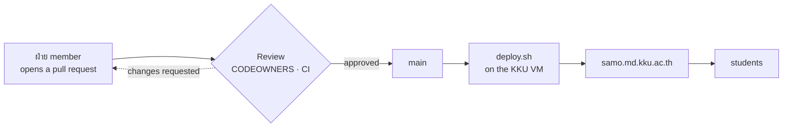

<div align="center">


### สโมสรนักศึกษา คณะแพทยศาสตร์ มหาวิทยาลัยขอนแก่น

**We build and run the software the student union uses every day.**<br>
Not a portfolio. Everything here is in production, used by students this week.

<a href="https://samo.md.kku.ac.th"><b>samo.md.kku.ac.th</b></a> &nbsp;·&nbsp;
<a href="https://samo.md.kku.ac.th/docs">Documentation</a> &nbsp;·&nbsp;
<a href="https://samo.md.kku.ac.th/updates">Release notes</a>

</div>

---

## What we actually run

| | Address | What it is for |
|---|---|---|
| **SAMO Web** | [samo.md.kku.ac.th](https://samo.md.kku.ac.th) | The portal. PR requests, VitalSound, หนังสือโครงการ, the shop, announcements, ฝ่าย tools |
| **SAMO Passport** | [/passport/](https://samo.md.kku.ac.th/passport/) | Activity points — students scan a QR code at an event and their km are recorded |
| **VitalSound** | [/vssound](https://samo.md.kku.ac.th/vssound) | A confidential route for a student to reach the people who can act on a problem |
| **Documentation** | [/docs](https://samo.md.kku.ac.th/docs) | How to run it, change it, and ship it. Written for the person who arrives next year |

Served from a Khon Kaen University VM — one hostname, one server, deployed over
ssh by a person on the university network.

## How a change reaches a student



**Pushing `main` does not deploy.** A person runs the deploy, on the university
network, and then checks the served page rather than an exit code. That is
deliberate: this is a student union, people graduate, and the only safe pipeline
is one somebody can read in an afternoon.

## Ten ฝ่าย, ten identities


<div align="center"><sub>
บริหารองค์กร · ดิจิทัลและสื่อสารองค์กร · กิจการภายใน · กิจการภายนอก · กิจการมหาวิทยาลัย ·
วิชาการ · ยุทธศาสตร์และพัฒนาองค์กร · คุณภาพชีวิตและสิ่งแวดล้อม · เวชนิทัศน์ · โครงการอื่นๆ
</sub></div>

Each ฝ่าย has its own colour, its own page, and its own tools. A tool is one entry
in a registry — not a request that waits for IT.

## You probably do not need to be added to anything

This is the part most people get wrong, so it is the part we put first.

**If you want to change one page, add a tool, or fix your ฝ่าย's text — you already
can.** Make your own copy, change it, send it back for review. Nobody has to grant
you anything, and nothing you do can reach production until someone approves it.

```bash
gh repo fork samomdkku/samomdkkuweb --clone
npm install
npm run dev
```

Then read **[the docs](https://samo.md.kku.ac.th/docs)** — start → install →
your first change. It is written for someone who has never opened this project.

<details>
<summary><b>For people running the project</b></summary>

<br>

- **Branch protection is real** — `main` needs review in both repositories, and
  force-push and deletion are blocked in both. A green build is required on
  `samomdkkuweb`; the passport repository has no CI yet, and requiring a check
  that nothing reports would freeze every pull request rather than guard it.
  Settings that live outside git are verified by a proof, not by memory.
- **Previews are per pull request**, built against a separate database. Nothing
  on a preview can reach production data — asserted on every run, after the day
  it silently could.
- **Every bug this project has paid for is written up** — symptom, cause, fix,
  and the general rule — so the next person does not buy it twice.
- **Access comes from team membership**, not from one person's attention. Any
  organisation owner can add someone.

</details>

## Built with

**Vite** · vanilla ES modules · **Bootstrap 5** — no frontend framework. The
person maintaining this next is a medical student who will read it cold, and
that shapes what is allowed to be in it.
**Supabase** for auth and Postgres, with row-level security as the real gate.
**Apps Script** as a thin proxy for Drive, mail and Discord.

<div align="center">
<br>
<sub>Made by students, for students, at the Faculty of Medicine, Khon Kaen University.</sub>
</div>
